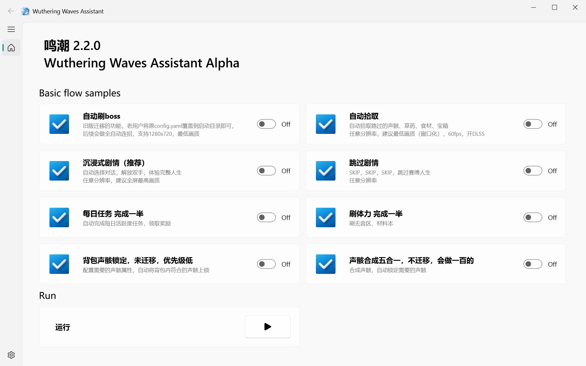

# Wuthering Waves Assistant

鸣潮自动化助手

📢 **QQ群: 1039535103**

---



---

## 📌 使用指南

### 1️⃣ 安装 Conda

前往 [Miniconda 官网](https://docs.conda.io/en/latest/miniconda.html) 下载 Miniconda，并按照默认设置安装。

### 2️⃣ 安装 Git

前往 [Git 官网](https://git-scm.com/) 下载并安装 Git，全程保持默认设置。

### 3️⃣ 准备环境

- 选择一个**路径中不包含中文**的文件夹来存放本项目。
- **以管理员身份**打开 PowerShell。

### 4️⃣ 下载项目

```powershell
git clone https://github.com/wakening/WutheringWavesAssistant.git
```

### 5️⃣ 安装依赖

```powershell
cd WutheringWavesAssistant
./scripts/rebuild_conda_env.ps1
```

等待脚本执行完成，安装所需环境。

### 6️⃣ 配置文件

- **老用户**（使用过 `mc_auto_boss` 的用户）：请复制 `config.yaml` 到本目录并覆盖。
- **新用户**：无需额外配置，可直接运行。

### 7️⃣ 启动脚本

**务必以管理员身份运行**，否则部分功能可能无法正常工作。

```powershell
python main.py
```

---

## ❓ 常见问题

### ⚠️ 脚本无法运行？
确保 **PowerShell 以管理员身份运行**，并且 Conda 和 Git 均已正确安装。

### ⚠️ 依赖安装失败？
重新运行 `./scripts/rebuild_conda_env.ps1` 以重建环境。

### ⚠️ 运行时报错？
加入我们的 **QQ群 (1039535103)** 交流或提交 Issue 反馈问题。

